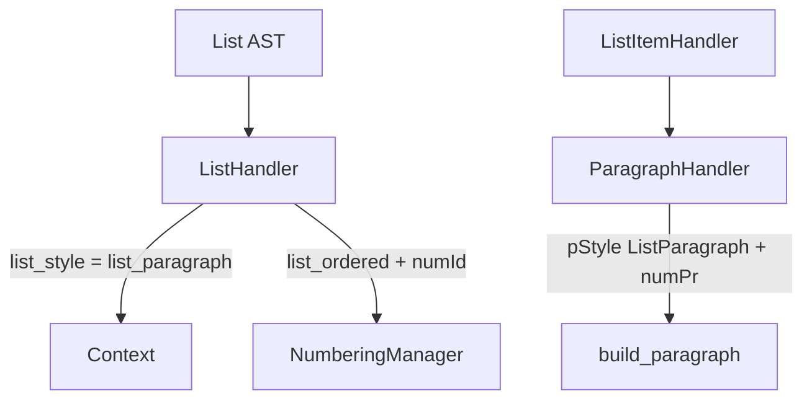

# Lists, Numbering & Table Styles

Iteration 10 connects lists and tables to the Style System while keeping **style**, **numbering**, and **table layout** as separate concerns.

## Three layers

```text
Style System (StyleRegistry / StyleManager)
  → paragraph styles (ListParagraph, Normal, …)
  → run styles (Code, …)
  → table styles (TableGrid via w:tblStyle)

NumberingManager
  → abstractNum, num, numId, ilvl
  → bullet vs decimal via abstractNumId (not paragraph pStyle)

OOXML table layer (ooxml/table.py)
  → tbl, tblPr, tblGrid, tr, tc, borders, widths, alignment
  → w:tblHeader on header rows
```

Handlers decide **semantics** only (list kind, table style id). They do not emit raw OOXML.

## Lists

### List item paragraph style

Every list item paragraph uses **`ListParagraph`** (`w:pStyle`). Bullet vs ordered is determined solely by **`w:numPr`**:

```xml
<w:pPr>
  <w:pStyle w:val="ListParagraph"/>
  <w:numPr>
    <w:ilvl w:val="0"/>
    <w:numId w:val="3"/>
  </w:numPr>
</w:pPr>
```

`ListBullet` and `ListNumber` remain in `styles.xml` for backward compatibility but are **not** emitted by handlers.

### Handler flow



| Component | Role |
|-----------|------|
| `ListHandler` | Sets `context.list_style = list_paragraph`; tracks `list_ordered`, `list_level`, `list_num_id`; inserts Normal separator between adjacent top-level lists |
| `ListItemHandler` | Processes block children |
| `ParagraphHandler` | Emits `ListParagraph` + `numPr` when `list_style` is set |
| `NumberingManager` | Owns `numbering.xml`; lvl `pStyle` is `ListParagraph` |

### Nested lists

- Same kind (bullet under bullet): reuse parent `numId`, increment `ilvl`.
- Different kind (ordered under bullet): allocate a **new** `numId` for the correct `abstractNum` (no restart override).
- Top-level restart: adjacent top-level lists of the same kind get a new `numId` with `startOverride=1`.

### Detecting active list paragraphs

`api.is_active_list_paragraph()` checks for **`numPr/numId`**, not `ListBullet`/`ListNumber` pStyle. This drives list separator insertion.

## Tables

### Table style

Semantic `table` maps to OOXML **`TableGrid`** via `w:tblStyle`:

```xml
<w:tblPr>
  <w:tblStyle w:val="TableGrid"/>
  …
</w:tblPr>
```

`TableHandler` resolves the semantic style through `StyleManager` and passes `table_style_id` to the document API.

### Header rows

AST `TableRow.header=True` (from `thead` / `th`) produces:

1. `w:trPr/w:tblHeader` on the row (Word repeat-header semantics)
2. Bold + centered cell paragraphs (visual fallback, unchanged)

### What stays in the table layer

Borders, column grid, cell margins, shading, valign, merge — all remain in `ooxml/table.py`. Cell paragraphs use **Normal** pStyle; inline formatting uses **RenderContext** (unchanged).

## Style ≠ Numbering ≠ Layout

| Concern | Owner | Example |
|---------|-------|---------|
| Paragraph appearance | Style System | `ListParagraph`, `Normal` |
| List markers & indents | NumberingManager | `numId`, `ilvl`, bullet glyph |
| Table borders & grid | OOXML table builder | `tblBorders`, `tblGrid` |
| Table Word style | Style System | `TableGrid` |
| Inline bold/italic/code | RenderContext | `w:rPr` on runs |

See also [`STYLE_SYSTEM.md`](STYLE_SYSTEM.md) and [`RENDERING_CONTEXT.md`](RENDERING_CONTEXT.md).

## Tests

| Area | Location |
|------|----------|
| List handler unit tests | `tests/elements/test_list.py` |
| NumberingManager unit tests | `tests/ooxml/test_numbering.py` |
| List integration | `tests/integration/test_*_list*.py` |
| Lists + tables integration | `tests/integration/test_lists_tables_integration.py` |
| Golden document.xml | `tests/golden/test_document_xml.py` |
| Golden numbering.xml | `tests/golden/test_numbering_xml.py` |
| Architecture boundaries | `tests/architecture/test_layer_boundaries.py` |

Regenerate document goldens:

```bash
python scripts/update-golden.py
```

Numbering goldens are fixture-specific (`tests/expected/*.numbering.xml` for list cases).
