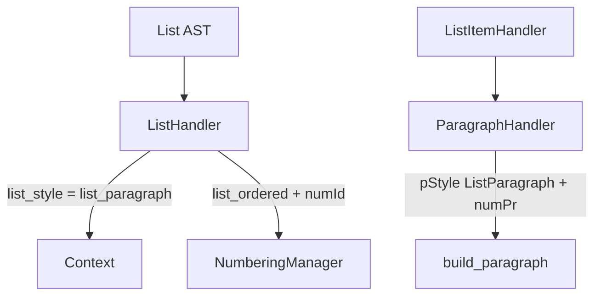

# Списки, нумерация и стили таблиц

Итерация 10 связывает списки и таблицы с системой стилей, сохраняя **стиль**, **нумерацию** и **макет таблицы** как отдельные области ответственности.

## Три слоя

```text
Style System (StyleRegistry / StyleManager)
  → paragraph styles (ListParagraph, Normal, …)
  → run styles (Code, …)
  → table styles (TableGrid via w:tblStyle)

NumberingManager
  → abstractNum, num, numId, ilvl
  → bullet vs decimal via abstractNumId (not paragraph pStyle)

OOXML table layer (ooxml/table.py)
  → tbl, tblPr, tblGrid, tr, tc, borders, widths, alignment
  → w:tblHeader on header rows
```

Обработчики решают только **семантику** (тип списка, id стиля таблицы). Они не генерируют сырой OOXML.

## Списки

### Стиль абзаца элемента списка

Каждый абзац элемента списка использует **`ListParagraph`** (`w:pStyle`). Маркированный vs нумерованный определяется исключительно через **`w:numPr`**:

```xml
<w:pPr>
  <w:pStyle w:val="ListParagraph"/>
  <w:numPr>
    <w:ilvl w:val="0"/>
    <w:numId w:val="3"/>
  </w:numPr>
</w:pPr>
```

`ListBullet` и `ListNumber` остаются в `styles.xml` для обратной совместимости, но **не** генерируются обработчиками.

### Поток обработчиков



| Компонент | Роль |
|-----------|------|
| `ListHandler` | Sets `context.list_style = list_paragraph`; tracks `list_ordered`, `list_level`, `list_num_id`; inserts Normal separator between adjacent top-level lists |
| `ListItemHandler` | Processes block children |
| `ParagraphHandler` | Emits `ListParagraph` + `numPr` when `list_style` is set |
| `NumberingManager` | Owns `numbering.xml`; lvl `pStyle` is `ListParagraph` |

### Вложенные списки

- Один тип (маркированный под маркированным): повторное использование родительского `numId`, увеличение `ilvl`.
- Разный тип (нумерованный под маркированным): выделение **нового** `numId` для правильного `abstractNum` (без override restart).
- Перезапуск верхнего уровня: смежные списки верхнего уровня одного типа получают новый `numId` с `startOverride=1`.

### Определение активных абзацев списка

`api.is_active_list_paragraph()` проверяет **`numPr/numId`**, а не pStyle `ListBullet`/`ListNumber`. Это управляет вставкой разделителя списков.

## Таблицы

### Стиль таблицы

Семантический `table` сопоставляется с OOXML **`TableGrid`** через `w:tblStyle`:

```xml
<w:tblPr>
  <w:tblStyle w:val="TableGrid"/>
  …
</w:tblPr>
```

`TableHandler` разрешает семантический стиль через `StyleManager` и передаёт `table_style_id` в API документа.

### Строки заголовков

AST `TableRow.header=True` (из `thead` / `th`) производит:

1. `w:trPr/w:tblHeader` на строке (семантика повторяющегося заголовка Word)
2. Жирные и выровненные по центру абзацы ячеек (визуальный запасной вариант, без изменений)

### Что остаётся в слое таблиц

Границы, сетка столбцов, поля ячеек, заливка, valign, объединение — всё остаётся в `ooxml/table.py`. Абзацы ячеек используют pStyle **Normal**; inline-форматирование использует **RenderContext** (без изменений).

## Стиль ≠ нумерация ≠ макет

| Область | Владелец | Пример |
|---------|-------|---------|
| Paragraph appearance | Style System | `ListParagraph`, `Normal` |
| List markers & indents | NumberingManager | `numId`, `ilvl`, bullet glyph |
| Table borders & grid | OOXML table builder | `tblBorders`, `tblGrid` |
| Table Word style | Style System | `TableGrid` |
| Inline bold/italic/code | RenderContext | `w:rPr` on runs |

См. также [`STYLE_SYSTEM.md`](STYLE_SYSTEM.md) и [`RENDERING_CONTEXT.md`](RENDERING_CONTEXT.md).

## Тесты

| Область | Расположение |
|------|----------|
| List handler unit tests | `tests/elements/test_list.py` |
| NumberingManager unit tests | `tests/ooxml/test_numbering.py` |
| List integration | `tests/integration/test_*_list*.py` |
| Lists + tables integration | `tests/integration/test_lists_tables_integration.py` |
| Golden document.xml | `tests/golden/test_document_xml.py` |
| Golden numbering.xml | `tests/golden/test_numbering_xml.py` |
| Architecture boundaries | `tests/architecture/test_layer_boundaries.py` |

Перегенерация golden document:

```bash
python scripts/update-golden.py
```

Golden numbering — специфичны для фикстур (`tests/expected/*.numbering.xml` for list cases).
