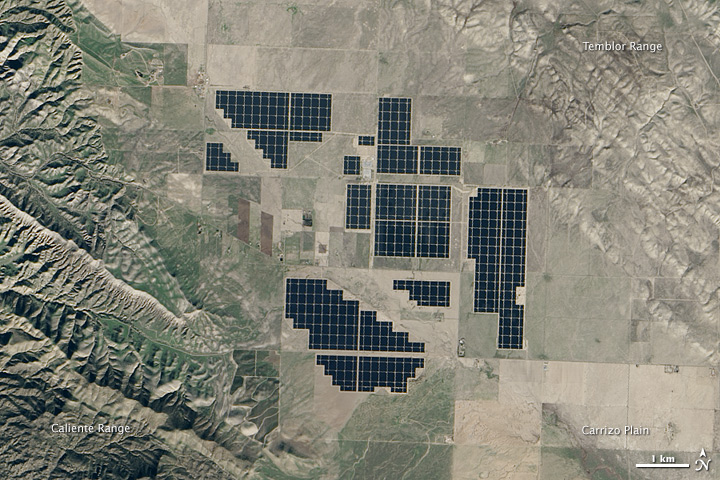
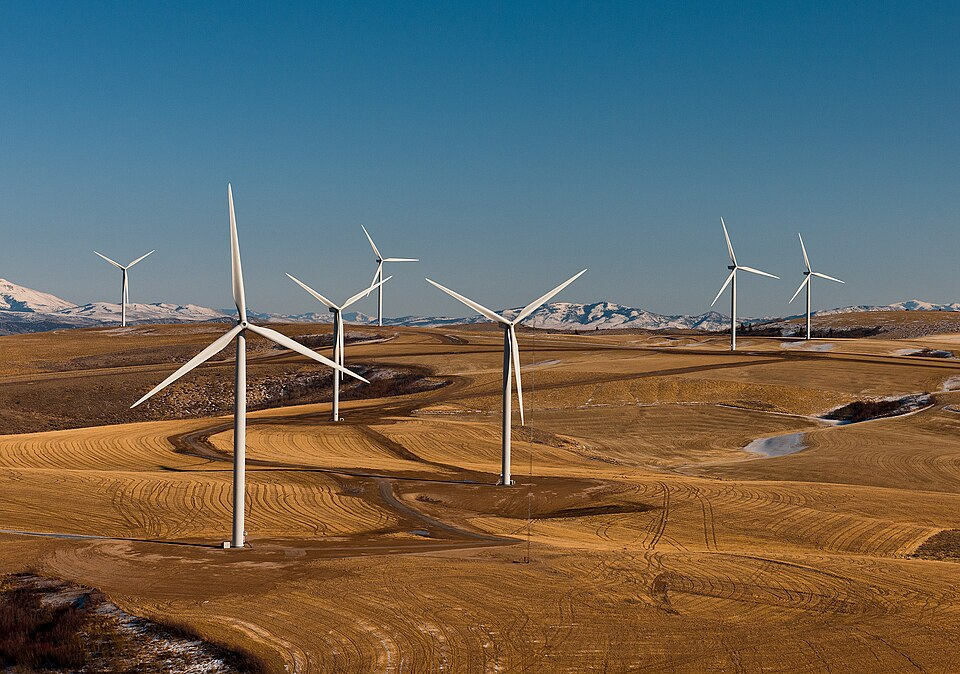
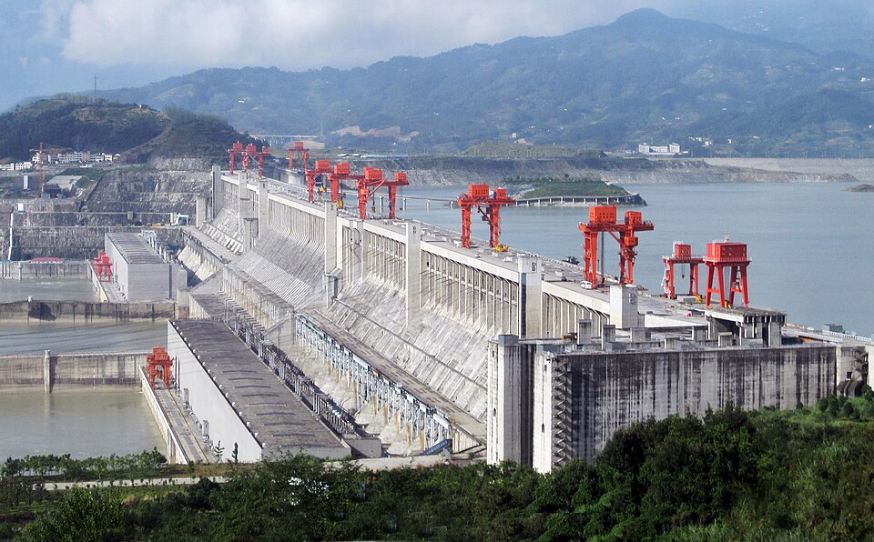

# Global Renewable Power Capacity in 2024

**Working paper — integration fixture for Markdown → DOCX pipeline**

*Corresponding author: e.morozova@example.org*

---

## Abstract

This note summarizes publicly available statistics on global renewable electricity capacity as reported by the **International Renewable Energy Agency (IRENA)** and the **International Energy Agency (IEA)**. At the end of 2024, worldwide renewable power capacity reached approximately **4,448 GW**, with record annual additions of **585 GW** (+15.1%). Solar photovoltaic (PV) and wind energy accounted for the overwhelming majority of net expansion. The document is structured as a *conditional* scientific article and is intended to exercise headings, inline formatting, lists, block quotations, code blocks, hyperlinks, images, metadata, and advanced table layouts in the **md2docx** converter.

> **Key finding:** Solar and wind jointly represented **96.6%** of all net renewable capacity additions in 2024 (IRENA, 2025).

---

## 1. Introduction

The global energy transition accelerated markedly in 2024. According to IRENA's *Renewable Capacity Statistics 2025*, renewable power capacity increased by **585 GW** in a single year—the highest absolute and percentage growth recorded since 2000. Solar PV alone contributed roughly **452 GW** of new capacity, while wind added **113 GW**. These figures underscore a structural shift: variable renewable technologies are no longer marginal contributors but the primary drivers of power-sector expansion in most major economies.

The IEA's *Renewables 2024* analysis complements this picture with forward-looking projections. Under stated policies, the IEA expects annual renewable capacity additions to approach **940 GW by 2030**, with solar PV and wind accounting for about **95%** of growth through the end of the decade. Grid integration, permitting timelines, and investment in flexible assets remain the principal constraints in Europe and North America, whereas manufacturing scale and deployment speed continue to favour **China**, which alone added nearly **80 GW** of wind capacity in 2024.

This article-style fixture reproduces a subset of these findings in prose and tabular form. It is **not** peer-reviewed research; it aggregates open statistics so that engineers can visually inspect DOCX output after conversion. Where figures appear, captions reference the original media repositories on [Wikimedia Commons](https://commons.wikimedia.org/) and agency publications.

### 1.1 Scope and limitations

The synthesis covers **utility-scale and distributed** renewable capacity where agencies report it in national statistics. It excludes pure off-grid installations unless folded into national totals. Hydrogen-ready electrolyser capacity, battery storage, and demand-side flexibility are discussed only qualitatively. Numerical rounding follows source documents (typically one decimal place for GW totals).

---

## 2. Background

Historically, **hydropower** dominated the renewable portfolio. By end-2024, however, solar PV (**1,865 GW**) had surpassed hydropower (**1,283 GW**) in cumulative installed capacity, with wind close behind at **1,133 GW**. Bioenergy (**151 GW**), geothermal (**15 GW**), and marine energy (**0.5 GW**) represent smaller but geographically important niches—particularly geothermal in East Africa and marine pilot projects in the North Sea.

Policy frameworks evolved in parallel. Auction-based remuneration, net-metering for rooftop PV, and corporate power purchase agreements (PPAs) expanded the investor base beyond traditional utilities. At the same time, supply-chain bottlenecks that affected wind turbine deliveries in 2022–2023 eased in several markets, allowing project pipelines to advance once permitting reforms took effect.

> Renewable power capacity increased by 585 GW (+15.1%) in 2024. Over three quarters of the capacity expansion was due to solar energy which witnessed an increase of 452 GW (+32.2%); this was followed by wind energy with additions of 113 GW (+11.1%).
>
> — IRENA, *Renewable Capacity Highlights 2025*

For methodological transparency, the pseudo-code in Section 4 illustrates how one might normalize country-level CSV extracts before aggregating by technology. The pipeline command `md2docx integration-article.md -o integration-article.docx` should preserve both the quotation above and the code block below without XML entity errors.

---

## 3. Data sources

Primary sources used in this fixture:

1. [IRENA — Renewable Capacity Statistics 2025 (highlights)](https://www.irena.org/Publications/2025/Mar/Renewable-capacity-statistics-2025)
2. [IEA — Renewables 2024: Executive summary](https://www.iea.org/reports/renewables-2024/executive-summary)
3. [IEA — Chart: Total renewable capacity additions by technology, 2019–2024](https://www.iea.org/data-and-statistics/charts/total-renewable-capacity-additions-by-technology-2019-2024)
4. [NASA Earth Observatory — Topaz Solar Farm feature](https://earthobservatory.nasa.gov/images/84452/topaz-solar-farm-california)

Secondary regional breakdowns (Section 5.3) are **illustrative** for table-merge testing and should not be cited in real publications without verification against primary databases.

---

## 4. Methods

We distinguish three processing stages:

- **Ingestion** — download agency tables (CSV/PDF) and map technology labels to a canonical schema;
- **Harmonization** — convert units to GW, reconcile reporting years, and flag revised series;
- **Publication** — render narrative sections, figures, and cross-reference tables.

Nested quality checks applied during harmonization:

- Source metadata
  - Publication year and DOI/URL recorded
  - Revision notes captured when agencies restate historical series
- Numeric validation
  - Row sums compared against announced global totals
  - Outliers (>3σ from five-year trend) manually reviewed

```python
# Illustrative normalization snippet (not executed in this fixture)
def to_gw(value_mw: float) -> float:
    return round(value_mw / 1000.0, 2)

def aggregate_by_tech(rows: list[dict]) -> dict[str, float]:
    totals: dict[str, float] = {}
    for row in rows:
        tech = row["technology"].strip().lower()
        totals[tech] = totals.get(tech, 0.0) + to_gw(row["capacity_mw"])
    return totals
```

Inline references such as the IEA licence (**CC BY 4.0** for chart reuse) appear as plain text with *italic emphasis* where appropriate. Technical identifiers (`solar_pv`, `onshore_wind`) use monospace `inline code` formatting.

### 4.1 List and numbering stress test

The constructs below exercise **ListParagraph** styling, `numId` allocation, mixed nesting (bullet ↔ ordered), list restart between sections, and inline formatting inside list items.

**Pre-publication checklist (ordered — restarts numbering from Section 3):**

1. Verify `numbering.xml` defines separate abstract formats for bullet and decimal lists
2. Confirm nested **ordered-under-bullet** lists receive a distinct `numId` when list kind changes
3. Validate *restart* behaviour between adjacent top-level lists of the same kind

**Mixed nested deployment structure (unordered root):**

- Solar PV — utility-scale and distributed segments
  1. Rooftop: **residential** and *commercial* installations
  2. Utility-scale: `single-axis` trackers and [bifacial modules](https://www.irena.org/Publications/2025/Mar/Renewable-capacity-statistics-2025)
  - Manufacturing hubs: China, Vietnam, India
- Wind energy — onshore and offshore pipelines
  1. Onshore repowering in **Europe** and India
  2. Offshore auctions in *North Sea* and Baltic basins
  - Supply chain: towers, blades, nacelles
- Storage and flexibility — batteries, pumped hydro, demand response
  1. Grid-scale BESS paired with solar–wind hybrids
  2. Long-duration pilots (`iron-air`, `flow` chemistries)
  - Policy: capacity markets and ancillary-service products

**Rich unordered items (inline formatting inside list bodies):**

- **Bold technology label** — solar PV at 452 GW added in 2024
- *Italic policy note* — auction designs vary by jurisdiction
- `inline_code` — `capacity_factor` estimates require site-specific data
- Hyperlink item — see [IEA Renewables 2024](https://www.iea.org/reports/renewables-2024/executive-summary)
- Combined run — **bold *nested italic* and `code`** in one list item

> Blockquote containing a short nested list:
>
> - Quoted bullet with **emphasis**
> - Second item with [IRENA highlights](https://www.irena.org/Publications/2025/Mar/Renewable-capacity-statistics-2025)

---

## 5. Results

### 5.1 Global capacity by technology (end-2024)

**Table 1** lists cumulative installed capacity by major technology class. Values follow IRENA headline statistics.

| Technology | Capacity (GW) | Share of total (%) |
|--------------|---------------|-------------------:|
| Solar PV | 1,865 | 41.9 |
| Hydropower | 1,283 | 28.8 |
| Wind power | 1,133 | 25.5 |
| Bioenergy | 151 | 3.4 |
| Geothermal | 15 | 0.3 |
| Marine | 0.5 | 0.01 |

Solar's share reflects both utility-scale plants and distributed rooftops. Wind totals combine onshore and offshore installations unless national statistics split them.

### 5.2 Additions in 2024 — alignment and formatting variants

**Table 2** demonstrates column alignment directives (`:---`, `:---:`, `---:`) while repeating 2024 addition figures.

| Technology | Added 2024 (GW) | YoY note |
|:-----------|:---------------:|---------:|
| Solar PV | 452.0 | Record year |
| Wind | 113.2 | Slight decline vs 2023 |
| Hydropower | 15.0 | Stable |
| Bioenergy | 4.6 | Moderate growth |

---

<!-- table: borders=none -->
| Scenario | 2030 capacity (GW) | Source |
|---|---|---|
| IEA main case | ~9,760 | Stated policies |
| IEA accelerated | ~11,000 | Tripling pathway |

**Table 3** uses invisible borders (`borders=none`) to simulate clean layout tables common in Word reports.

---

<!-- table: borders=double -->
| Indicator | 2023 | 2024 |
|---|---|---|
| Global RE additions (GW) | ~510 | 585 |
| Solar share of additions (%) | ~73 | ~77 |

**Table 4** applies double borders for emphasis—useful when checking border serialization in OOXML.

### 5.3 Regional illustration with merged cells

The following table is **illustrative** and exercises horizontal merge (empty cell), vertical merge (`^^`), cell shading, and vertical alignment.

| Region | Country / city | Population (millions) |
|--------|----------------|----------------------:|
| Europe | | — |
| | Minsk | 9.4 |
| | Paris | 2.1 |
| Asia | Beijing | 21.5 |
| Americas | New York | 8.3 |

| Group | Technology | 2024 additions (GW) |
|-------|------------|--------------------:|
| Variable RE | Solar PV | 452 |
| ^^ | Wind | 113 |
| ^^ | Offshore wind | 12 |
| Dispatchable | Hydropower | 15 |
| Dispatchable | Geothermal | 0.4 |

| Section | Metric | Value |
|---------|--------|------:|
| {bg:yellow}Summary | | |
| {bg:green}Solar PV | Capacity added | 452 |
| {bg:green}Solar PV | Share of RE additions | 77% |
| {bg:blue}Wind | Capacity added | 113 |

| Parameter | Setting |
|:---------:|:-------:|
| {valign:center}:Combined align: | {bg:E8F4FD}{valign:center}:Centered cell: |

### 5.3.1 Deployment readiness matrix

**Table 5** includes an explicit header row for `w:tblHeader` testing and inline formatting inside cells.

| Technology | 2024 status | Primary source |
|--------------|-------------|----------------|
| Solar PV | **Record additions** (452 GW) | [IRENA 2025](https://www.irena.org/Publications/2025/Mar/Renewable-capacity-statistics-2025) |
| Wind | *Moderate growth*; supply chain easing | [IEA chart](https://www.iea.org/data-and-statistics/charts/total-renewable-capacity-additions-by-technology-2019-2024) |
| Storage | `Emerging` — hybrid PPAs | Internal estimate |
| Hydropower | Stable baseload role | IRENA statistics |

**Table 6** nests list-like content in cells via multi-paragraph cell text (same row, rich inline runs):

| Region | Highlights |
|--------|------------|
| Asia | **China** leads wind additions; India scales solar auctions |
| Europe | *Offshore* growth; permitting reforms in Germany and Spain |
| Americas | Utility-scale solar in US Southwest; `PPA` volumes rising |

### 5.4 Figures

**Figure 1.** Topaz Solar Farm, Carrizo Plain, California — one of the largest PV plants worldwide (public-domain NASA Earth Observatory image).



**Figure 2.** Wind turbines at Power County Wind Farm, Idaho, USA (US government work — public domain).



**Figure 3.** Three Gorges Dam, China — the world's largest hydropower station by installed capacity (CC BY-SA 3.0, Wikimedia Commons).



---

## 6. Discussion

Several themes emerge from the 2024 statistics:

1. **Solar dominance** — PV additions exceeded the combined growth of all other renewable technologies. Learning-curve effects in module manufacturing and balance-of-system costs continue to compress LCOE estimates in sunny regions.
2. **Wind recovery** — After supply-chain stress, onshore wind pipelines in Europe and India improved, while China retained a disproportionate share of global turbine installations.
3. **Hydropower stability** — Large hydro projects (Figure 3) operate as baseload and flexibility providers, but social and environmental licensing limits greenfield development in many basins.
4. **Integration challenge** — The IEA stresses that achieving a tripling of renewable capacity by 2030 requires faster grid expansion and storage deployment than observed in the 2017–2023 period.

Cross-cutting observations:

- **Manufacturing geography** — PV module production is highly concentrated in Asia; trade policy increasingly influences effective deployment costs elsewhere.
- **Distributed vs utility scale**
  - Rooftop PV accelerates consumer participation
  - Utility-scale plants drive absolute GW additions
  1. Hybrid solar–storage PPAs blur traditional market boundaries
  2. Corporate offtakers demand *hourly* matching certificates
  - Community energy cooperatives expand in **Europe**
- **Data quality** — Agencies revise historical series when countries restate statistics; harmonization scripts (Section 4) should version source files.
  1. Track DOI and retrieval date for each CSV extract
  2. Flag restated rows with `revision_id` in metadata
  - Compare against prior-year snapshots before publishing tables

Special characters regression check: coefficients α ≈ 0.92, temperature ΔT > 2 °C, and unit strings such as `kg CO₂/kWh` should survive conversion. Links with query parameters—see [IEA chart licence](https://www.iea.org/data-and-statistics/charts/total-renewable-capacity-additions-by-technology-2019-2024)—must remain clickable.

---

## 7. Conclusion

Global renewable capacity reached **4,448 GW** in 2024, growing **15.1%** in a single year. Solar PV and wind are the central technologies of this expansion, together accounting for **96.6%** of net additions. Agency projections to 2030 imply sustained growth, but policy implementation—not resource potential—remains the binding constraint in most OECD markets.

This document serves as a **five-page integration fixture** for md2docx. Successful conversion should yield:

- populated `docProps/core.xml` from YAML front matter;
- multiple `w:tbl` variants with borders, shading, merges, alignment, and **tblHeader** on header rows;
- embedded images under `word/media/`;
- mixed inline runs (**bold**, *italic*, `code`, hyperlinks);
- block quotations, lists, horizontal rules, and fenced code blocks;
- **ListParagraph** items with mixed nested bullet/ordered lists and distinct `numId` on kind change;
- ordered list **restart** across Sections 3, 4.1, 6, and References.

---

## References

1. IRENA (2025). *Renewable Capacity Statistics 2025* — Capacity Highlights. Abu Dhabi: International Renewable Energy Agency. https://www.irena.org/Publications/2025/Mar/Renewable-capacity-statistics-2025
2. IEA (2024). *Renewables 2024*. Paris: International Energy Agency. https://www.iea.org/reports/renewables-2024
3. IEA (2025). Total renewable capacity additions by technology, 2019–2024 [Chart]. Licence: CC BY 4.0. https://www.iea.org/data-and-statistics/charts/total-renewable-capacity-additions-by-technology-2019-2024
4. NASA Earth Observatory (2015). Topaz Solar Farm, California Valley. https://earthobservatory.nasa.gov/images/84452/topaz-solar-farm-california
5. Wikimedia Commons contributors. File: *Topaz Solar Farm, California Valley.jpg*; *Power County Wind Farm 002.jpg*; *ThreeGorgesDam-China2009.jpg*. https://commons.wikimedia.org/

---

## Appendix A — Notation

| Symbol | Meaning |
|--------|---------|
| GW | Gigawatt (10⁹ watts) |
| LCOE | Levelized cost of electricity |
| PPA | Power purchase agreement |
| RE | Renewable energy |

---

## Appendix B — Combined list and table smoke test

Final regression block mixing a compact table with adjacent lists.

| Check | Expected |
|-------|----------|
| List pStyle | `ListParagraph` on all list items |
| Table style | `w:tblStyle` = TableGrid |
| Header row | `w:tblHeader` present |

Post-table ordered steps:

1. Open output in Word and confirm list markers render
2. Toggle table header repeat on long tables
3. Export PDF and verify hyperlinks remain active

Post-table unordered reminders:

- Do not cite Section 5.3 regional tables in real publications
- Re-run `python scripts/validate-docx.py --fixtures` after pipeline changes
  1. Package validation must pass
  2. Golden snapshots updated when OOXML structure changes intentionally

---

*Document generated as an md2docx integration fixture. Statistical values reflect publicly reported agency data as of early 2025; regional breakdown tables in Section 5.3 are illustrative.*
